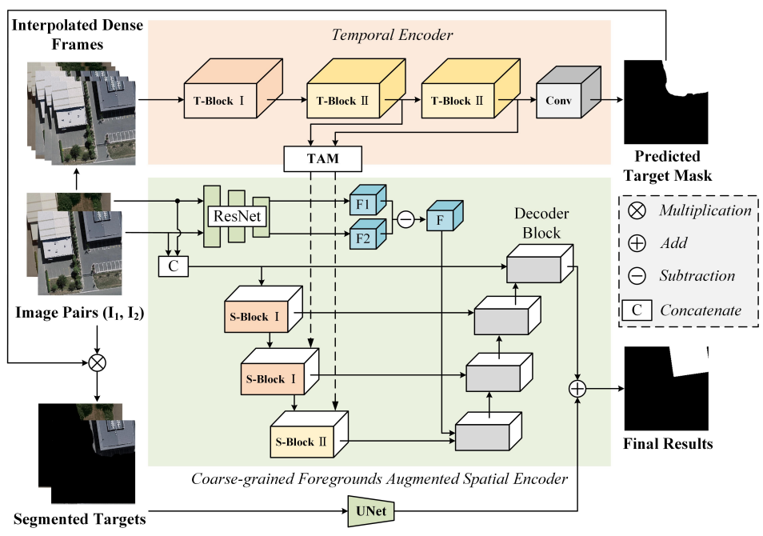

# Feature 3 - Multiframe Temporal Fusion Architecture

### The Problem

Standard OCR reads one cropped image at a time. For license plates captured from low-resolution video, **a single frame is often blurry, occluded, or motion-distorted**. Adjacent frames of the same plate are highly redundant — together they provide complementary information not available in any single frame.

The challenge is to exploit this temporal context **without retraining the entire recognition pipeline from scratch**, and without breaking the weight-loading from pretrained PP-OCRv5 checkpoints.

### The Design

> [!NOTE]
> Temporal modules (T-Block, TAM) are adapted from [Treat Stillness with Movement: Remote Sensing Change Detection via Coarse-grained Temporal Foregrounds Mining (2024)](https://arxiv.org/pdf/2408.08078).


*Figure: Multiframe Temporal Encoder and TAM approach (Source: Treat Stillness with Movement paper)*

We extend `PPHGNetV2` with a **Hybrid Spatial-Temporal dual-branch** architecture. The spatial branch reuses pretrained 2D convolutions in a *TimeDistributed* fashion. The temporal branch adds parallel 3D convolution pathways that capture inter-frame motion and texture differences. Both branches fuse via element-wise addition after each stage.

```
Input: [B, 5, C, H, W]          (5 frames per plate track)
           │
     ┌─────┴─────┐
     │           │
  Spatial     Temporal
  (2D)         (3D)
     │           │
  Stem(2D)   TBlockI ←── 3D Conv, stride (1,2,2)×2 → [B, 48, T, H/4, W/4]
     │           │
  Stage1  ResBlock3D×2 ────────────┐
     └─────┬─────┘  element-wise + │  (Additive Fusion)
           │◄──────────────────────┘
     ┌─────┴─────┐
  Stage2  ResBlock3D×2 ──────────┐
     └─────┬─────┘  element-wise +│  (Additive Fusion)
           │◄─────────────────────┘
           │
         TAM  ←── avg_pool + max_pool over T → collapse temporal dim
           │                     [B, 1024, H', W']
      NeckAdapter  ←── Conv2D stride(2,1) × 2 + AdaptiveAvgPool (H→1)
           │
    Output: [B, 1024, 1, W']    (compatible with NRTR/CTC heads)
```


**Key design decisions:**

| Decision | Rationale |
|:---|:---|
| Additive fusion (not concat) | Preserves pretrained channel count — no new projection layers needed |
| Only Stage 1-2 active in temporal mode | TAM already captures all inter-frame information, stages 3-4 add no benefit |
| Stages 3-4 still instantiated | Allows clean weight loading from any standard PP-OCRv5 checkpoint without missing-key errors |
| Stride matching | Temporal ResBlock3D strides mirror spatial stage strides so features stay spatially aligned |

---

### Step 1 — New Temporal Modules (`temporal_modules.py`)

**File:** `PaddleOCR/ppocr/modeling/backbones/temporal_modules.py` *(new file)*

This file holds all new building blocks. You should never need to touch it unless you want to experiment with a different temporal aggregation strategy.

#### `BasicConv3D` — The Primitive

```python
class BasicConv3D(nn.Layer):
    """Conv3D + BatchNorm3D + ReLU building block."""
    def __init__(self, in_ch, out_ch, kernel_size, stride=(1,1,1), padding=None):
        super().__init__()
        if padding is None:
            padding = tuple(k // 2 for k in (kernel_size if isinstance(kernel_size, tuple) else (kernel_size,)*3))
        self.conv = nn.Conv3D(in_ch, out_ch, kernel_size, stride=stride, padding=padding, bias_attr=False)
        self.bn   = nn.BatchNorm3D(out_ch)
        self.act  = nn.ReLU()

    def forward(self, x):
        return self.act(self.bn(self.conv(x)))
```

#### `ResBlock3D_Paddle` — The Workhorse

A 3D bottleneck residual block (`1×1×1 → 3×3×3 → 1×1×1`) with optional spatial downsampling via stride. This is the main building block for the temporal branch stages.

```python
class ResBlock3D_Paddle(nn.Layer):
    """3D residual bottleneck: 1x1→3x3→1x1 with optional stride shortcut."""
    def __init__(self, in_ch, mid_ch, out_ch, stride=(1,1,1)):
        super().__init__()
        self.conv1 = BasicConv3D(in_ch,  mid_ch, 1)
        self.conv2 = BasicConv3D(mid_ch, mid_ch, 3, stride=stride)
        self.conv3 = BasicConv3D(mid_ch, out_ch, 1)
        # Downsampling shortcut: only created when input/output channels differ
        self.shortcut = None
        if in_ch != out_ch or any(s != 1 for s in stride):
            self.shortcut = BasicConv3D(in_ch, out_ch, 1, stride=stride)

    def forward(self, x):
        residual = x if self.shortcut is None else self.shortcut(x)
        return self.conv3(self.conv2(self.conv1(x))) + residual
```

#### `TBlockI_Paddle` — Temporal Stem

The temporal stem processes the raw 5-frame tensor and reduces spatial resolution 4× while keeping the temporal dimension intact. It runs in parallel with the 2D spatial stem.

```python
class TBlockI_Paddle(nn.Layer):
    """
    Temporal stem: two BasicConv3D with spatial stride (1,2,2) each.
    Input : [B, in_ch, T, H, W]
    Output: [B, out_ch, T, H/4, W/4]
    """
    def __init__(self, in_ch=3, out_ch=48):
        super().__init__()
        self.stem = nn.Sequential(
            BasicConv3D(in_ch, 32,     kernel_size=(3,3,3), stride=(1,2,2)),
            BasicConv3D(32,    out_ch, kernel_size=(3,3,3), stride=(1,2,2)),
        )

    def forward(self, x):
        return self.stem(x)
```

> **Why stride `(1,2,2)` twice?** We want to halve H and W (matching the 2D stem's output resolution) without touching T. Applying it twice gives ×4 spatial reduction and keeps T = 5 throughout.

#### `TAM_Paddle` — Temporal Aggregation Module

After both branches have processed all frames, we need to collapse the temporal dimension `T` back to a 2D feature map. TAM does this by computing channel-wise statistical descriptors across frames:

```python
class TAM_Paddle(nn.Layer):
    """
    Temporal Aggregation Module.
    Computes avg-pool and max-pool over T, concatenates, then projects.

    Input : [B, in_ch, T, H, W]
    Output: [B, out_ch, H, W]
    """
    def __init__(self, in_ch, out_ch):
        super().__init__()
        self.proj = nn.Conv2D(in_ch * 2, out_ch, kernel_size=1)

    def forward(self, x):
        # x: [B, C, T, H, W]
        avg = paddle.mean(x, axis=2)   # [B, C, H, W]
        mx  = paddle.max(x,  axis=2)   # [B, C, H, W]
        out = paddle.concat([avg, mx], axis=1)  # [B, 2C, H, W]
        return self.proj(out)           # [B, out_ch, H, W]
```

> **Why avg + max?** Average captures the "typical" appearance across frames; max retains the "sharpest" signal for any given pixel over time. Combining both gives richer temporal descriptors than either alone.

#### `NeckAdapter_Paddle` — Height Collapse

The recognition heads (NRTR, CTC) expect a 1D feature sequence `[B, C, 1, W']`. `NeckAdapter` collapses the height dimension from `H'` → 1:

```python
class NeckAdapter_Paddle(nn.Layer):
    """
    Two Conv2D layers (stride (2,1)) then AdaptiveAvgPool2D(H→1).

    Input : [B, in_ch, H, W]
    Output: [B, out_ch, 1, W']
    """
    def __init__(self, in_ch, out_ch):
        super().__init__()
        self.conv1 = nn.Conv2D(in_ch,  in_ch,  kernel_size=3, stride=(2,1), padding=1)
        self.conv2 = nn.Conv2D(in_ch,  out_ch, kernel_size=3, stride=(2,1), padding=1)
        self.pool  = nn.AdaptiveAvgPool2D((1, None))  # collapse H to 1, keep W

    def forward(self, x):
        return self.pool(self.conv2(self.conv1(x)))
```

---

### Step 2 — Wiring Temporal Modules into PPHGNetV2

**File modified:** `PaddleOCR/ppocr/modeling/backbones/rec_pphgnetv2.py`

#### `__init__` — New Temporal Parameters

```python
def __init__(
    self,
    ...,
    use_temporal=False,     # Set True to activate the temporal branch
    frozen_stages=-1,
    **kwargs,
):
    ...
    self.use_temporal = use_temporal

    # --- Spatial stem (always created) ---
    self.stem = StemBlock(in_channels=stem_channels[0], ...)

    # --- Temporal stem (only when temporal mode is active) ---
    if self.use_temporal:
        self.temporal_stem = TBlockI_Paddle(stem_channels[0], 48)
```

For the stage loop, only Stage 1-2 are given paired temporal blocks. Stages 3-4 are instantiated normally (for weight-loading compatibility) but never called:

```python
    temporal_blocks = []

    for i, k in enumerate(stage_config):
        stage_2d = HGV2_Stage(...)

        if i >= 2:
            # Instantiate but don't connect to temporal branch
            self.stages.append(stage_2d)
            continue

        self.stages.append(stage_2d)

        if self.use_temporal:
            if i == 0:
                # Stage 1: PPHGNetV2_B4 stride [2,1] → reduces H
                t_block = nn.Sequential(
                    ResBlock3D_Paddle(48,  128,  48,  stride=(1, 2, 1)),
                    ResBlock3D_Paddle(128, 128,  48),
                )
            else:  # i == 1
                # Stage 2: PPHGNetV2_B4 stride [1,2] → reduces W
                t_block = nn.Sequential(
                    ResBlock3D_Paddle(48,  512,  128, stride=(1, 1, 2)),
                    ResBlock3D_Paddle(512, 512,  128),
                )
            temporal_blocks.append(t_block)

    if self.use_temporal:
        self.temporal_stages = nn.LayerList(temporal_blocks)
        self.tam     = TAM_Paddle(512, 1024)
        self.adapter = NeckAdapter_Paddle(1024, 1024)
        self.out_channels = 1024   # override: head must now expect 1024 channels
```

#### `forward` — The Full Temporal Pass

```python
def forward(self, x):
    if self.use_temporal:
        # Input arrives as [B, T, C, H, W] from the data loader
        # Transpose to [B, C, T, H, W] for Conv3D convention
        x = x.transpose([0, 2, 1, 3, 4])
        B, C, T, H, W = x.shape

        # --- Spatial branch: TimeDistributed stem ---
        # Flatten B and T, run the 2D stem, then unflatten
        x_flat = x.transpose([0, 2, 1, 3, 4]).reshape([B * T, C, H, W])
        s_x    = self.stem(x_flat)                            # [B*T, C', H', W']
        s_shape = s_x.shape
        s_x = s_x.reshape([B, T, s_shape[1], s_shape[2], s_shape[3]])
        s_x = s_x.transpose([0, 2, 1, 3, 4])                 # [B, C', T, H', W']

        # --- Temporal branch ---
        t_x = self.temporal_stem(x)                           # [B, 48, T, H/4, W/4]

    else:
        s_x = self.stem(x)

    # --- Stage loop ---
    for i, stage in enumerate(self.stages):
        if self.use_temporal and i >= 2:
            break   # only stages 0 and 1 are active in temporal mode

        if self.use_temporal:
            # Spatial: TimeDistributed(stage)
            B, C, T, H, W = s_x.shape
            s_x_flat = s_x.transpose([0, 2, 1, 3, 4]).reshape([B * T, C, H, W])
            s_x_flat = stage(s_x_flat)
            s_shape  = s_x_flat.shape
            s_x = s_x_flat.reshape([B, T, s_shape[1], s_shape[2], s_shape[3]])
            s_x = s_x.transpose([0, 2, 1, 3, 4])             # [B, C', T, H'', W'']

            # Temporal: run the paired 3D block
            t_x = self.temporal_stages[i](t_x)               # [B, C', T, H'', W'']

            # Additive fusion (not concatenation — preserves channel count)
            s_x = s_x + t_x
        else:
            s_x = stage(s_x)

    if self.use_temporal:
        x_2d = self.tam(s_x)       # [B, 1024, H', W'] — temporal dim collapsed
        return self.adapter(x_2d)  # [B, 1024, 1, W']  — height collapsed to 1
    ...
```

---

