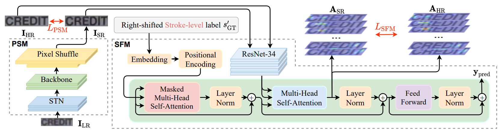

# Super Resolution (SR)

This module trains a Super Resolution model that enhances low-resolution license plate crops **before** they are fed into the OCR recognition pipeline. SR is the first stage in the full inference chain:

```
LR video frame
    │
Plate detector  (detection model)
    │
Crop + track
    │
SR model        ← This module
    │
OCR recognizer  (see README_OCR.md)
    │
Plate text
```


*Figure: Gestalt architecture featuring PSN (TSRN) and SFM (Source: Text Gestalt paper)*

This repo uses the **Gestalt** algorithm (TSRN + `StrokeFocusLoss`), adapted from [Text Gestalt: Stroke-Aware Scene Text Image Super-Resolution (AAAI 2022)](https://arxiv.org/pdf/2112.08171).

> [!NOTE]
> **If you re-clone `PaddleOCR/`** as a fresh submodule, all source-level patches described below must be re-applied.

---

## Table of Contents

1. [Quick Start](#quick-start)
2. [Dataset Setup](#dataset-setup)
3. [PaddleOCR SR Modifications Overview](#paddleocr-sr-modifications-overview)
4. [Training](#training)
5. [Inference](#inference)
6. [Config Reference](#config-reference)

## Quick Start

```bash
# Step 1: Build LMDB dataset from cropped tracks
python scripts/data/build_lmdb_sr.py

# Step 2: Verify dataset integrity
python scripts/tools/verify_lmdb_sr.py --lmdb_dir data/lmdb_sr/train_lmdb

# Step 3: Verify english_decomposition.txt exists
# Gestalt cannot run without this file — it is used by both StrokeFocusLoss (loss computation)
# and SRLabelEncode (data transform). Training will crash immediately if the file is missing.
ls data/english_decomposition.txt

# Step 4: Download and fix pretrained weights
mkdir -p weights/pretrained/sr
wget -P weights/pretrained/sr/ \
    https://paddleocr.bj.bcebos.com/dygraph_v2.0/sr/sr_tsrn_transformer_strock_train.tar
tar -xf weights/pretrained/sr/sr_tsrn_transformer_strock_train.tar -C weights/pretrained/sr/

python scripts/tools/fix_sr_pretrained.py \
    --input  weights/pretrained/sr/sr_tsrn_transformer_strock_train/best_accuracy.pdparams \
    --output weights/pretrained/sr/sr_tsrn_transformer_strock_train/best_accuracy_fixed.pdparams \
    --algo   gestalt

# Step 5: Train
uv run python scripts/train/train_sr.py --algo gestalt
```

---

## Dataset Setup

The SR model is trained on **LR/HR image pairs** stored in LMDB format. Each entry contains the LR crop (input) and the corresponding HR crop (supervision target).

```bash
# Build LMDB from cropped plate tracks
# Uses 500 tracks/country from Scenario B as Test,
#      500 pairs as Val,
#      and the rest as Train.
python scripts/data/build_lmdb_sr.py
```

Generated structure:
```
data/lmdb_sr/
├── train_lmdb/
├── val_lmdb/
└── test_lmdb/
```

Verify before training to catch corrupted entries early:
```bash
python scripts/tools/verify_lmdb_sr.py --lmdb_dir data/lmdb_sr/train_lmdb
# Prints: total entries, sample shapes, any decode failures
```

The config specifies `LMDBDataSetSR` as the dataset class, which handles the LR/HR pair format natively:

```yaml
# configs/sr/sr_gestalt_plate.yml
Train:
  dataset:
    name: LMDBDataSetSR
    data_dir: data/lmdb_sr/train_lmdb
    transforms:
      - SRResize:
          imgH: 48
          imgW: 320
          down_sample_scale: 1
      - SRLabelEncode:
          character_dict_path: data/english_decomposition.txt
      - KeepKeys:
          keep_keys: ['img_lr', 'img_hr', 'length', 'input_tensor', 'label']
```

---

## PaddleOCR SR Modifications Overview

### Feature 1 — Input Size Alignment (48×320)
> Configures the SR model to process full-resolution 48×320 plates without fixed upscaling factors.
→ [Full documentation](input_alignment.md)

### Feature 2 — STN Linear Layer Fix
> Fixes the hardcoded dimension inside the Spatial Transformer Network to support our 48×320 plates.
→ [Full documentation](stn_fix.md)

### Feature 3 — Selective Freeze Strategy (SFM vs PSM)
> Implements correct weight freezing for the guidance recognizer (SFM) so it doesn't degrade during SR training.
→ [Full documentation](selective_freeze.md)

### Feature 4 — Pretrained Weight Prefix Remapping
> Patches the official pretrained model weights to be compatible with PaddleOCR's BaseModel architecture.
→ [Full documentation](prefix_remapping.md)

---

## Training

```bash
uv run python scripts/train/train_sr.py --algo gestalt --seed 42
```

`train_sr.py` internally resolves the config path from `CONFIGS_DIR / "sr" / f"sr_{algo}_plate.yml"` and calls PaddleOCR's standard training runner. The seed is passed to PaddlePaddle's global seed for reproducibility.

**Training output:**
```
weights/finetuned/sr/gestalt_plate/
├── best_accuracy.pdparams    ← best model on val set
├── best_accuracy.pdopt
├── latest.pdparams
└── train.log
```

**Key training hyperparameters** (set in `sr_gestalt_plate.yml`):

| Parameter | Value | Notes |
|:---|:---|:---|
| `epoch_num` | 50 | Fine-tuning from pretrained |
| `learning_rate` | 0.0001 | Adam with `beta1=0.5`, `beta2=0.999` |
| `clip_norm` | 0.25 | Gradient clipping — critical for TSRN stability |
| `batch_size_per_card` | 22 | Tuned for 24GB VRAM with AMP O2 |
| `use_amp` | True | AMP O2 (`float16`) — ~40% VRAM reduction |
| `scale_loss` | 1024.0 | Dynamic loss scaling for AMP stability |

---

## Inference

After training, run SR inference on a directory of LR plate crops:

```bash
uv run python scripts/infer/infer_sr.py \
    --image_dir  data/tracks/lr_crops/ \
    --config     configs/sr/sr_gestalt_plate.yml \
    --checkpoint weights/finetuned/sr/gestalt_plate/best_accuracy \
    --output_dir output/inference/sr_result/
```

The script is a thin wrapper around PaddleOCR's `tools/infer_sr.py` that:
1. Resolves all paths to absolute (avoids relative-path issues in subprocess)
2. Sets `PYTHONPATH` to include `PaddleOCR/` so internal imports resolve correctly
3. Passes `Global.checkpoints`, `Global.infer_img`, and `Global.save_visual` as override args

Output images are written to `--output_dir` with the same filenames as input.

---

## Config Reference

**Full annotated `sr_gestalt_plate.yml`:**

```yaml
Global:
  use_gpu: true
  epoch_num: 50
  log_smooth_window: 20
  print_batch_step: 10
  save_model_dir: weights/finetuned/sr/gestalt_plate/
  save_epoch_step: 5
  eval_batch_step: [0, 400]           # evaluate starting at step 0, then every 400 steps
  cal_metric_during_train: False

  pretrained_model: weights/pretrained/sr/.../best_accuracy_fixed  # always use _fixed
  checkpoints: null                   # set to resume from a checkpoint

  use_amp: True
  amp_level: O2
  amp_dtype: float16
  scale_loss: 1024.0
  use_dynamic_loss_scaling: True

  character_dict_path: data/english_decomposition.txt   # required for StrokeFocusLoss

Optimizer:
  name: Adam
  beta1: 0.5
  beta2: 0.999
  clip_norm: 0.25                     # important: TSRN training is unstable without this
  lr:
    learning_rate: 0.0001

Architecture:
  model_type: sr
  algorithm: Gestalt
  Transform:
    name: TSRN
    STN: True                         # enable Spatial Transformer Network
    width: 320                        # must match imgW
    height: 48                        # must match imgH
    scale_factor: 1                   # enhancement mode (not upscaling)

Loss:
  name: StrokeFocusLoss
  character_dict_path: data/english_decomposition.txt

Metric:
  name: SRMetric
  main_indicator: all

Train:
  dataset:
    name: LMDBDataSetSR
    data_dir: data/lmdb_sr/train_lmdb
    transforms:
      - SRResize:
          imgH: 48
          imgW: 320
          down_sample_scale: 1
      - SRLabelEncode:
          character_dict_path: data/english_decomposition.txt
      - KeepKeys:
          keep_keys: ['img_lr', 'img_hr', 'length', 'input_tensor', 'label']
  loader:
    shuffle: true
    batch_size_per_card: 22
    drop_last: True
    num_workers: 4

Eval:
  dataset:
    name: LMDBDataSetSR
    data_dir: data/lmdb_sr/val_lmdb
    transforms:
      - SRResize:
          imgH: 48
          imgW: 320
          down_sample_scale: 1
      - SRLabelEncode:
          character_dict_path: data/english_decomposition.txt
      - KeepKeys:
          keep_keys: ['img_lr', 'img_hr', 'length', 'input_tensor', 'label']
  loader:
    shuffle: False
    drop_last: False
    batch_size_per_card: 16
    num_workers: 4
```

